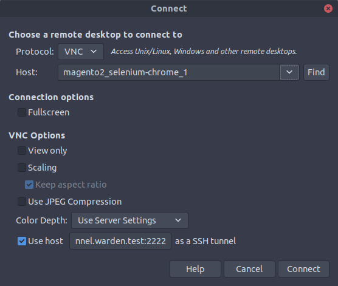

## Advanced Configuration

### Configuring LiveReload on Magento 2

TODO Add documentation on adding the following into the `env.php` file including usage information:

```
'design' => [
    'footer' => [
        'absolute_footer' => '
            <script id="__lr_script__">//<![CDATA[
                document.write("<script src=\'/livereload.js?port=443\'/>");
            //]]></script>
        '
    ]
]
```

### Using Xdebug with PHPStorm

There are two docker containers running FPM, `php-fpm` and `php-debug`. The `php-debug` container has the Xdebug extension pre-installed. Nginx will automatically route requests to the `php-debug` container when the `XDEBUG_SESSION` cookie has been set to `PHPSTORM` via the Xdebug Helper browser extension.

Xdebug will automatically connect back to the host machine on port 9000 for each request routed to the `php-debug` container (i.e. when the `XDEBUG_SESSION` cookie is set). When configuring Xdebug Helper in your browser, make sure it is setting this cookie with the value `PHPSTORM`. When it receives the first request, PHP Storm should prompt you if the "Server" configuration is missing. The below image demonstrates how this is setup; the important settings are these:

* Name: `clnt-docker` (this is the value of the `WARDEN_ENV_NAME` variable in the `.env` file appended with a `-docker` suffix)
* Host: `127.0.0.1`
* Port: `80`
* Debugger: Xdebug
* Use path mappings must be enabled, with a mapping to link the project root on the host with `/var/www/html` within the container.


### Profiling Requests with Blackfire

For information on what Blackfire is, please see the [introduction to Blackfire](https://blackfire.io/docs/introduction) in Blackfire documentation.

Blackfire may be enabled on both `magento1` and `magento2` env types by adding the following to the project's `.env` file (or exporting them to environment variables prior to starting the environment):

```
WARDEN_BLACKFIRE=1

BLACKFIRE_CLIENT_ID=<client_id>
BLACKFIRE_CLIENT_TOKEN=<client_token>
BLACKFIRE_SERVER_ID=<server_id>
BLACKFIRE_SERVER_TOKEN=<server_token>
```

Note: You can obtain the IDs and Tokens used in the above from within your Blackfire account under Account Settings -> Credentials or from the credentials are of the environment you're pushing profile information into.

### Connecting to Database via SSH Tunnel

#### Connection settings in TablePlus


#### Connection settings in Sequel Pro


#### Connection settings in PHPStorm


### Testing with Magento Functional Testing Framework

For information what **Magento Functional Testing Framework** is - please follow to [MFTF DevDocs](https://devdocs.magento.com/mftf/docs/introduction.html).

MFTF is part of Magento 2. To run tests you need [Selenium](https://selenium.dev/) instance with [Chrome Webdriver](https://sites.google.com/a/chromium.org/chromedriver/). Warden provides Docker setup that contains Selenium Standalone with Chrome. You can enable it by adding the following to the project's `.env` file (or exporting them to environment variables prior to starting the environment):

```
WARDEN_SELENIUM=1
```

After generating MFTF configuration files (`dev/tests/acceptance/.env` generated by `vendor/bin/mftf setup:env` command), you need to provide selenium hostname:

```
SELENIUM_HOST=selenium
BROWSER=chrome
```

To preview the process of testing, you need any **VLC** client that provides **SSH Tunnel** support (eg. [Remmina](https://remmina.org/how-to-install-remmina/)). To preview the process of testing, you need to use `tunnel.warden.test:2222` (login: `user`):

* Remote Desktop Viewer

   

* Remmina

  
