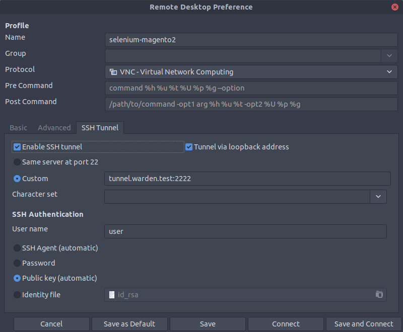

## Magento Functional Testing Framework

For information what **Magento Functional Testing Framework** is - please follow to [MFTF DevDocs](https://devdocs.magento.com/mftf/docs/introduction.html).

MFTF is part of Magento 2. To run tests you need [Selenium](https://selenium.dev/) instance with [Chrome Webdriver](https://sites.google.com/a/chromium.org/chromedriver/). Warden provides Docker setup that contains Selenium Standalone with Chrome. You can enable it by adding the following to the project's `.env` file (or exporting them to environment variables prior to starting the environment):

```
WARDEN_SELENIUM=1
```

After generating MFTF configuration files (`dev/tests/acceptance/.env` generated by `vendor/bin/mftf setup:env` command), you need to provide selenium hostname:

```
SELENIUM_HOST=selenium-hub
BROWSER=chrome
```

### Debugging MFTF Tests

By default Warden uses headless Chrome browser. If you want to preview the tests - you need to extend `.env` file and update environment containers (`warden env up -d`)

```
WARDEN_SELENIUM_DEBUG=1
```

**Default password for VNC session is `secret`**

To preview the process of testing, you need any **VLC** client that provides **SSH Tunnel** support (eg. [Remmina](https://remmina.org/how-to-install-remmina/)). To preview the process of testing, you need to use `tunnel.warden.test:2222` (login: `user`):

### Remote Desktop Viewer

   

### Remmina

  

### Allure reports

To access Allure reports generated (automatically updated each 60 seconds), you need to open in your browser:

* https://allure.exampleproject.test/
