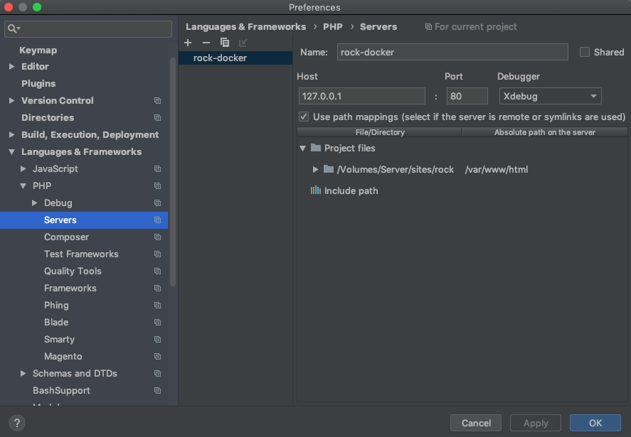

## Using Xdebug with PHPStorm

There are two docker containers running FPM, `php-fpm` and `php-debug`. The `php-debug` container has the Xdebug extension pre-installed. Nginx will automatically route requests to the `php-debug` container when the `XDEBUG_SESSION` cookie has been set to `PHPSTORM` via the Xdebug Helper browser extension.

Xdebug will automatically connect back to the host machine on port 9000 for each request routed to the `php-debug` container (i.e. when the `XDEBUG_SESSION` cookie is set). When configuring Xdebug Helper in your browser, make sure it is setting this cookie with the value `PHPSTORM`. When it receives the first request, PHP Storm should prompt you if the "Server" configuration is missing. The below image demonstrates how this is setup; the important settings are these:

* Name: `clnt-docker` (this is the value of the `WARDEN_ENV_NAME` variable in the `.env` file appended with a `-docker` suffix)
* Host: `127.0.0.1`
* Port: `80`
* Debugger: Xdebug
* Use path mappings must be enabled, with a mapping to link the project root on the host with `/var/www/html` within the container.

